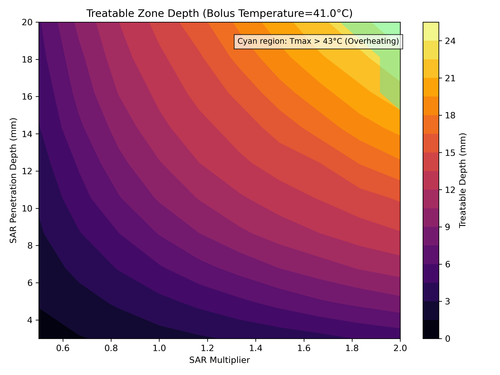

# Hyperthermic Cancer Treatment Simulation
*Academic Project | University of Leeds | Python | 2026*

## Overview

Computational simulation of tissue heat diffusion for **superficial hyperthermia**, a cancer treatment technique that applies localised heat to damage tumour cells while preserving surrounding healthy tissue.

Two models are implemented, leading up to in a SAR + water-bolus cooling model with full multi-parameter treatment planning analysis.

## Equation

The models are based on the **Pennes Bioheat Equation**:
$$\rho c \frac{\partial T}{\partial t} = \frac{\partial}{\partial z}\left(k \frac{\partial T}{\partial z}\right) + \rho_b c_b \omega(T_b - T) + Q_{\text{met}} + Q_{\text{SAR}}(z)$$

## Numerical Method

**Scheme:** Explicit FTCS (Forward-Time Centred-Space) finite difference

---

### Model 1: Surface Heating ( 43°C )

**Result:** Treatable depth of *~8 mm*, limited to the fat layer.

---

### Sensitivity Analysis

Treatable depth as a function of surface applicator temperature (41°C – 47°C):

---

### Model 2: SAR + Water-Bolus Cooling
A clinically realistic model replacing the fixed-temperature surface BC with a Robin (convective) boundary condition representing water-bolus cooling, combined with a **volumetric SAR heat source**.

### SAR Heating Profile

Exponential energy deposition with controllable penetration depth $\delta$:

$$Q_{\text{SAR}}(z) = Q_0 \times SAR_{multiplier} \times e^{-z/\delta}$$

### Parameter Space Exploration

A 10×10 grid sweep over SAR multiplier (0.5×–2.0×) and penetration depth (3–20 mm) at fixed bolus temperature 41°C:

